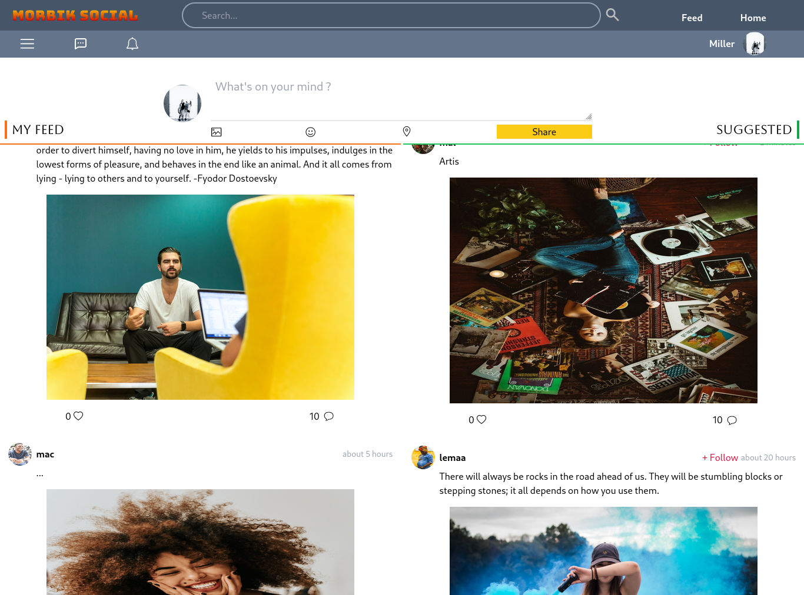
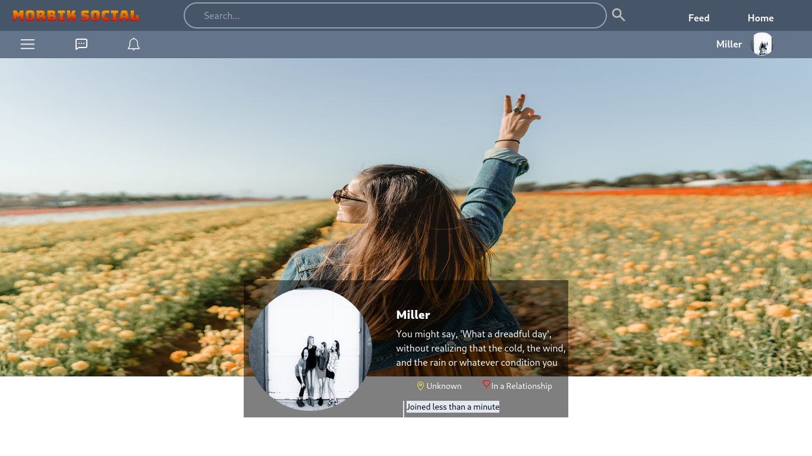
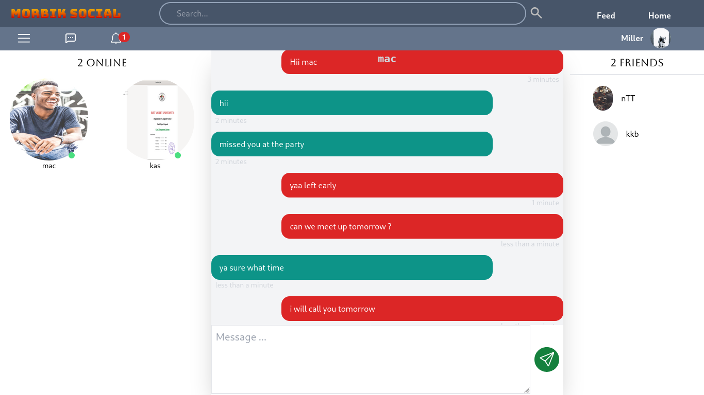
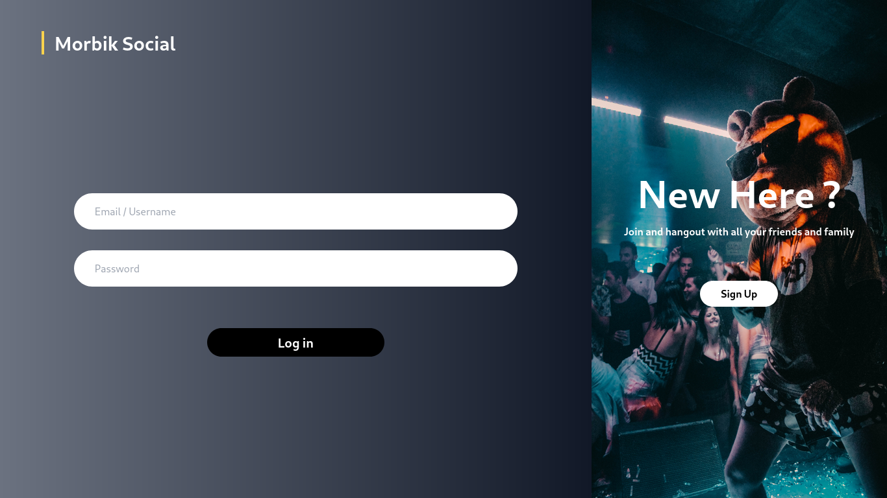

# Morbik Social

This is a simple social media projects with all the major functionality , which include 
    <!-- <li style="width: 100%; margin-left: 15%;font-family:Calibri; ">signin / login</li>
    <li style="width: 100%; margin-left: 15%;font-family:Calibri; ">post/share image or text</li>
    <li style="width: 100%; margin-left: 15%;font-family:Calibri; ">like/dislike posts </li>
    <li style="width: 100%; margin-left: 15%;font-family:Calibri; ">follow/unfollow users </li>
    <li style="width: 100%; margin-left: 15%;font-family:Calibri; ">real time one-on-one messaging </li>
    <li style="width: 100%; margin-left: 15%;font-family:Calibri; margin-bottom : 3rem">showing online users and so on. </li> -->

    - signin / login
    - post/share image or text
    - like/dislike posts
    - follow/unfollow users
    - real time one-on-one messaging
    - showing online users and so on.

 
    

This is a MERN stack project and that also uses tailwind for styling.
 
 

### Built using
<code>#reactjs #tailwind #nodejs #express #web sockets #jsonwebtoken #Cloudinary file hosting </code>
 
 
 

## Project Screenshots<h2>

<!-- 

    
    
    
    
    

 -->

<!-- 

 -->

 
 

<table>
    <tr>
        <td >
    
        </td>
        <td>
    
        </td>
    </tr>
     <tr>
        <td>
    
        </td>
        <td>
    
        </td>
    </tr>
    <tr>
        <td>
    
        </td>
    </tr>
</table>
 

 

<a href="https://morbiksocial.onrender.com" > Go to project </a>

