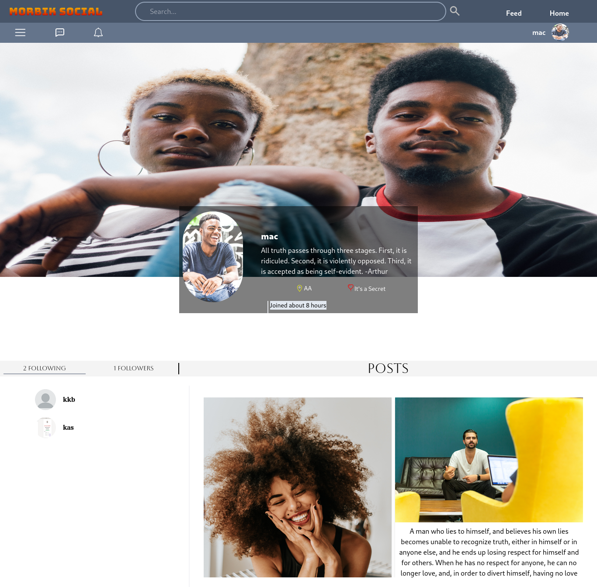

# Morbik Social

This is a simple social media projects with all the major functionality , which include 
    <!-- <li style="width: 100%; margin-left: 15%;font-family:Calibri; ">signin / login</li>
    <li style="width: 100%; margin-left: 15%;font-family:Calibri; ">post/share image or text</li>
    <li style="width: 100%; margin-left: 15%;font-family:Calibri; ">like/dislike posts </li>
    <li style="width: 100%; margin-left: 15%;font-family:Calibri; ">follow/unfollow users </li>
    <li style="width: 100%; margin-left: 15%;font-family:Calibri; ">real time one-on-one messaging </li>
    <li style="width: 100%; margin-left: 15%;font-family:Calibri; margin-bottom : 3rem">showing online users and so on. </li> -->

    - signin / login
    - post/share image or text
    - like/dislike posts
    - follow/unfollow users
    - real time one-on-one messaging
    - showing online users and so on.

    

This is a MERN stack project and that also uses tailwind for styling.

### Built using
<code>#reactjs #tailwind #nodejs #express #web sockets #jsonwebtoken #Cloudinary file hosting </code>

## Project Screenshots<h2>

<!-- 

    
    
    
    
    

 -->

<!-- 
<a href="ss" style=" color:gold; text-align:center font-family:Calibri; font-size: 1rem; "> Go to project </a>
 -->

[Go to project](https://morbiksocial.onrender.com)

